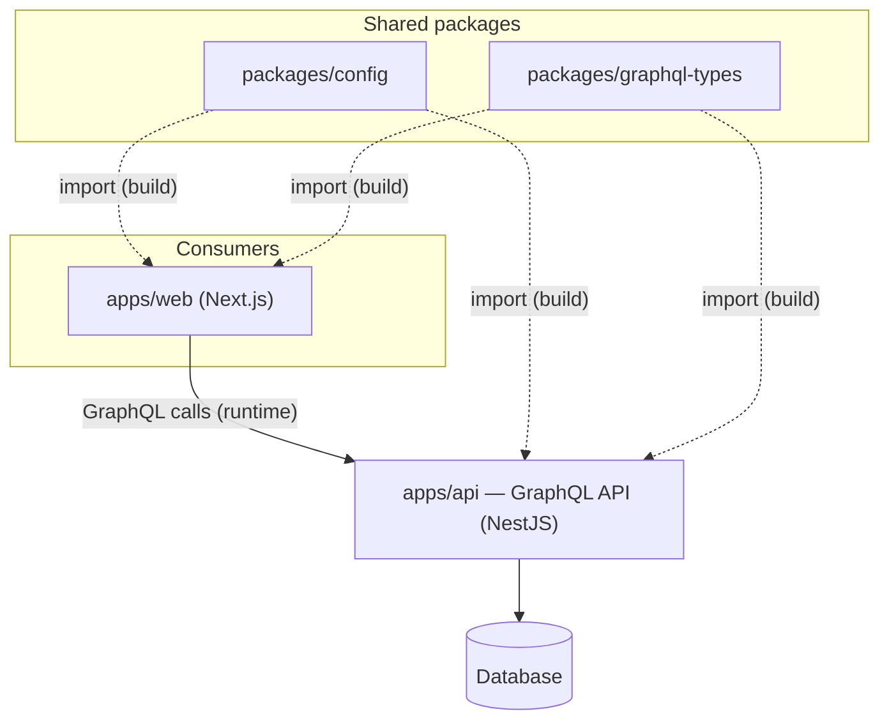

# Repo Map

<!-- TODO: This is the registry the root `CLAUDE.md` router points at. Keep it current:
     one row per unit. The router stays tiny by deferring the detail to this file. -->

This is a single **pnpm monorepo**. The units below are workspace packages (`apps/*`,
`packages/*`), what each does, and where its docs live.

> **Onboarded** (`/onboard-repo .`) as one unit `smart-tracker`.
> Stacks: `graphql-apollo-server`, `graphql-apollo-client`, `has-eslint`, `has-prettier`, `has-frontend`.
> Queryable architecture graph (Graphify, 537 nodes / 500 edges / 74 communities):
> [`docs/smart-tracker/architecture/`](./smart-tracker/architecture/) · conventions:
> [`docs/smart-tracker/conventions.md`](./smart-tracker/conventions.md).

| Unit | Role | Stack | Docs |
|---|---|---|---|
| `apps/api` | Backend — serves the GraphQL API, owns the DB & auth | NestJS · Apollo GraphQL · MikroORM | [`docs/api/`](./api/) <!-- created by /onboard-repo --> |
| `apps/web` | Frontend — web client consuming the API | Next.js · React | [`docs/web/`](./web/) <!-- created by /onboard-repo --> |
| `packages/config` | Shared config consumed across the workspace | TypeScript | [`docs/config/`](./config/) <!-- created by /onboard-repo --> |
| `packages/graphql-types` | Shared GraphQL types (codegen output) | TypeScript · GraphQL codegen | [`docs/graphql-types/`](./graphql-types/) <!-- created by /onboard-repo --> |

## How they connect

Unlike a multi-repo Lodestar workspace, these units share one repo and **are** wired
together statically: `apps/web` and `apps/api` import the shared `packages/*` at build time
(pnpm workspace). At **runtime**, `apps/web` also talks to `apps/api` over the **GraphQL
API** — that network edge is the "spine" of the system, documented by hand in
[`docs/_shared/api-contract.md`](./_shared/api-contract.md).

- **Contract / spine:** [`docs/_shared/api-contract.md`](./_shared/api-contract.md)
- **Auth across units:** [`docs/_shared/auth-model.md`](./_shared/auth-model.md)
- **Environments:** [`docs/_shared/env-matrix.md`](./_shared/env-matrix.md)
- **Run it all locally:** [`docs/_shared/local-setup.md`](./_shared/local-setup.md)

## Diagram

